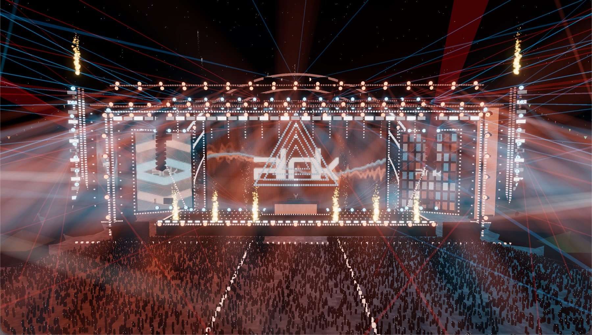
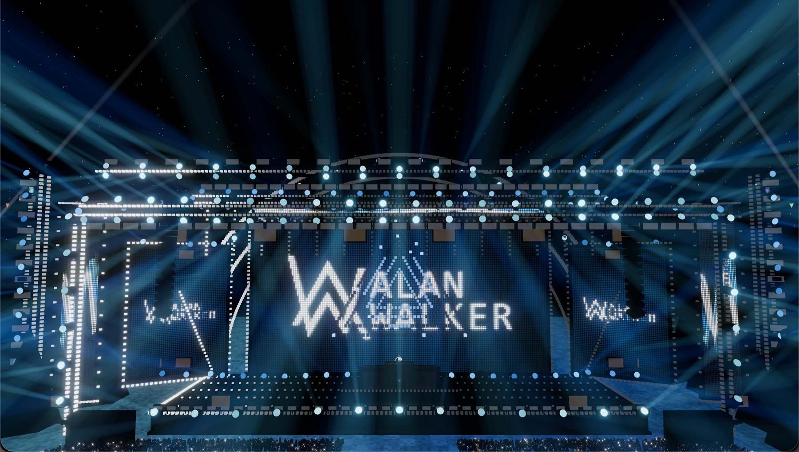
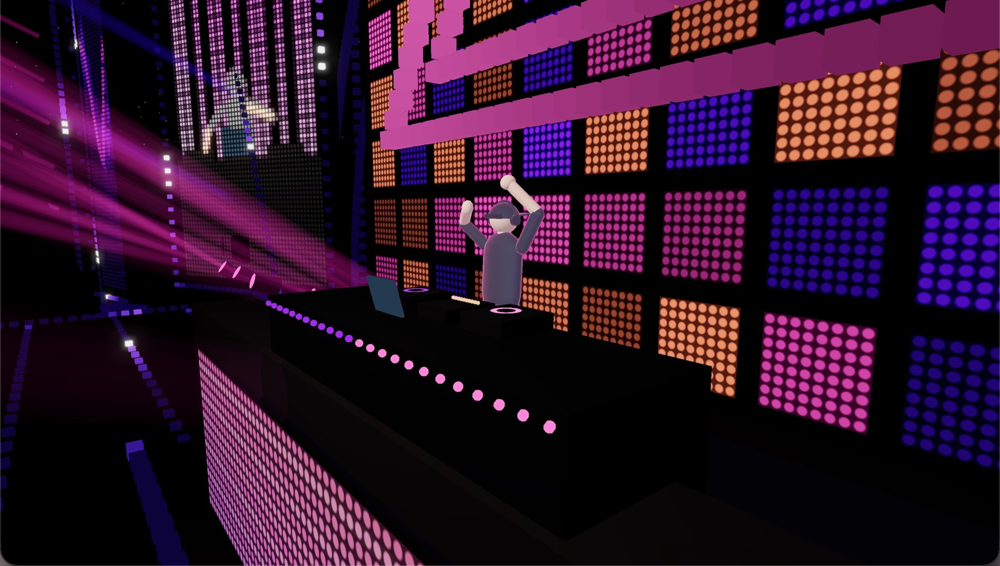
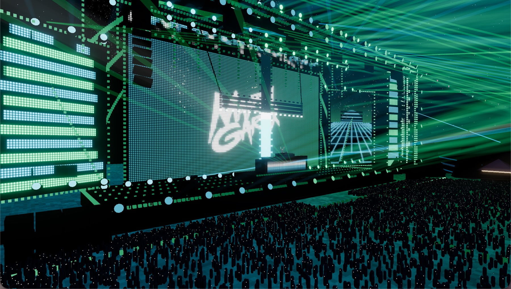

# Virtual Music Festival

**Stop only listening to EDM. Watch it.**

A Tomorrowland / Ultra style festival main stage rendered live in your browser with three.js, driven
by whatever your Spotify is playing. LED walls, moving heads, strobes, lasers, pixel architecture,
CO2 jets, flames, cold sparks and fireworks all run to the beat grid of the actual song, on a
per-artist stage design with a per-song colour theme and the artist's real logo on the screens.

- 180+ artist profiles across 21 EDM genres, each with its own centrepiece: Martin Garrix's "+",
  Armin's towers, Tiesto's arch, Eric Prydz's HOLO, the deadmau5 cube, the Excision megawall.
  Unknown artists get their genre's rig.
- 21 centrepiece designs, 27 LED wall programs, 5 colour theme modes, so no two songs look alike.
- Two stages, each its own build. The Mainstage is the black-truss festival rig. The Future Stage has no
  truss at all: a sleeping golden oracle under two fans of giant petals, an arch-shaped main screen,
  leaf-shaped side screens, bud spires, a halo that opens on the drop and waterfalls at the edges.
  Switch with the Stage button or `T`, or open `?stage=future`.
- POV mode puts you in the crowd. You watch through the eyes of one person, hands and heads around you,
  and the view cuts from person to person with the music. POV button or `V`, or open `?pov=1`.
- Open world mode lets you walk the festival yourself, like a game. `WASD` or the arrow keys move, the
  mouse looks around, `Shift` runs, `Space` jumps, and `Q` swaps between third person and first person.
  You are a visitor: the perimeter fence and the closed exit keep you on the grounds, and the pit, the
  stage, backstage, the lighting towers and the ride machinery are crew only. Walk button or `G`, or
  open `?walk=1` (`?walk=first` for first person).
- Real artist logos, fetched and cached. NoCopyrightSounds releases carry the NCS mark.
- Runs on macOS, Linux and Windows. Anyone on your network can watch the same show in their browser.

This is a local app, not a service. It runs on your machine, reads your own Spotify, and talks to
nothing but the logo and NCS lookups. No account, no Spotify login.

## Run

```sh
npm install
npm start          # serves http://localhost:5173
```

Open <http://localhost:5173>, press ENTER THE FESTIVAL, press play in Spotify. Node 18+ is required
(developed on Node 24). Then, per platform:

### macOS

Audio is captured with a Core Audio process tap (macOS 14.2+) that reads Spotify's own output. No
virtual audio driver is needed and Spotify keeps playing through your speakers. The tap binary
builds itself on first run, so you need the Xcode command line tools (`xcode-select --install` gives
you `swiftc`). The first start asks to let your terminal record system audio: accept it in System
Settings, Privacy and Security, Screen and System Audio Recording, then restart `npm start`. Title,
artist, artwork and position come from Spotify over AppleScript.

### Linux

Audio comes from the default sink's monitor source, so it follows whatever is coming out of the
speakers. Install the recorder and the metadata reader:

```sh
sudo apt install pulseaudio-utils playerctl     # Debian / Ubuntu (or pipewire-utils for pw-record)
sudo dnf install pulseaudio-utils playerctl     # Fedora
sudo pacman -S libpulse playerctl               # Arch
```

`parec` is used when present, otherwise `pw-record`. Title, artist, album, artwork and position come
from Spotify over MPRIS through `playerctl`.

### Windows

Windows has no always-present loopback device, so audio goes through ffmpeg and a loopback input:

1. Install ffmpeg and put it on `PATH` (`winget install Gyan.FFmpeg`).
2. Enable Stereo Mix (Sound settings, More sound settings, Recording, right-click, Show Disabled
   Devices, enable Stereo Mix), or install [VB-CABLE](https://vb-audio.com/Cable/) or VoiceMeeter and
   play Spotify into it.
3. `npm start`. The server auto-detects Stereo Mix / What U Hear / CABLE Output / VoiceMeeter Out /
   Loopback. If it picks the wrong one, run `ffmpeg -list_devices true -f dshow -i dummy` and set
   `VF_AUDIO_DEVICE` to the exact device name.

Title, artist, album and position come from Windows itself, read through Windows PowerShell 5.1, and
fall back to Spotify's window title. Windows exposes no album artwork, so the artwork colour blend is
skipped there. The artist and genre palettes still drive the whole show.

### Any platform: bring your own capture

Set `VF_AUDIO_CMD` to any command that writes float32 little-endian, mono, 48 kHz PCM to stdout and
it is used instead of the built-in backends:

```sh
VF_AUDIO_CMD='ffmpeg -f pulse -i my.monitor -ac 1 -ar 48000 -f f32le -' npm start
```

Phones and tablets get a "come back on a computer" notice, since the show wants a wide screen and a
real GPU, with a "let me in anyway" button for small laptops and desktops that report a touch screen.

## Screenshots








